# Makeover a plot from Merchandise Trade of Singapore

*This is written as the requirements for the [Visual Analytics module](https://wiki.smu.edu.sg/2021t2isss608/Course_information) for [MITB](https://scis.smu.edu.sg/master-it-business).*

```{r setup, include=FALSE}
knitr::opts_chunk$set(echo = TRUE)
```

For my first DataViz makeover, I have used the data from [Merchandise Trade of Singapore](https://www.singstat.gov.sg/find-data/search-by-theme/trade-and-investment/merchandise-trade/latest-data) , which analyses the Top 6 countries and regions export and import to Singapore.

# 1. The original data visualization


The original plot has two main problems:
1. I cannot tell the Top 6 ranking from this picture.
2. I cannot see very clearly the difference and relationship between export and import for each country or region.


# 2. Critiques and suggestions

## 2.1 Clarity


| S/N   | Critiques     | Comments       |
|:-----:|:------------- |:-------------- |
|   1   | Cannot distinguish Top 6 sequence from the chart | Sequence the order from largest to smallest |
|   2   | The axis for each sub chart is different. | Change to same axis that can demonstrate all six charts. |
|   3   | The original data has thousand dollars as unit, but the chart didn’t show that. | Mention the unit in the y axis. |


## 2.2 Aesthetics

| S/N   | Critiques     | Comments       |
|:-----:|:------------- |:-------------- |
|   1   | Lines with filling area is not good to see the difference between import and export. | Change to normal line plot without filling the area. |
|   2   | Six plots don’t have the same size. | Change them into same size. |
|   3   | The title of x axis is not accurate. | Change the title to fit with the plot. |
|   4   | The original plot cannot see the difference of export and import clearly. | Use color to distinguish export and import, as well as the difference. |


# 3. Proposed Design

## 3.1 Sketch of Proposition

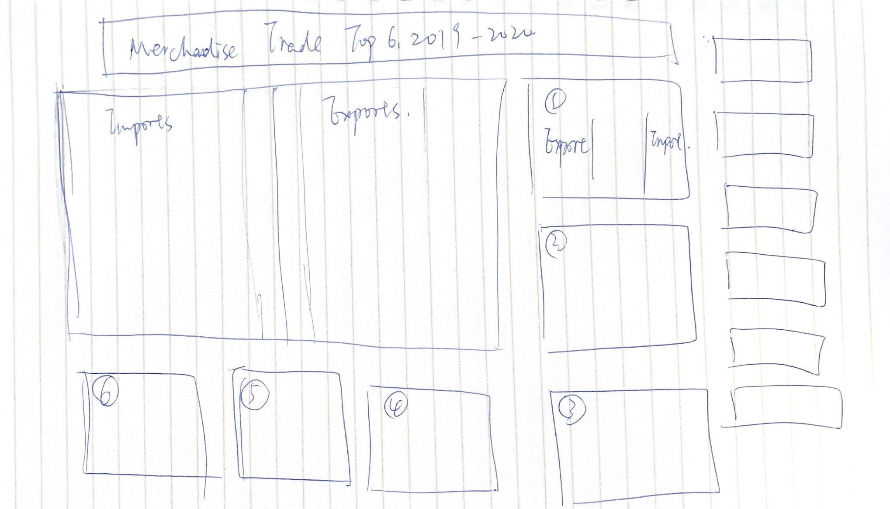
I will put import and export for total Top 6 countries and regions, and put separately six countries and regions as the sequence of Total(import+export) ranking.

Moreoever, I will compute the difference of export and import (Export-Import) as the label of tooltips in each subplots from 1 to 6.

## 3.2. Improvment to achieve
* i) More Information to show - I put the total overall of import and export for Top 6 countries and regions. 

* ii) Clear plot - I use line plot to show the trend and comparison for each country or regions separately.

* iii) Ranking for intuitive - I use floating number to show the ranking for six countries and regions.

* iv) Axises are properly labeled - I add unit for the two bigger plot, and change the name of x axis and y axis.

* v) Colors are consistent throughout the whole dashboard.

# 4. Data Visualization steps

For data preparation, I use excel, Tableau Prep and R to do the data cleaning, selection and transformation.

For data visualization, I use Tableau to finish all the steps.

## 4.1. Data preparation

For data preparation, first I check the data in excel to ensure all the data I want is clean and clear. Then, I import all the original data to Tableau Prep to run the flow and select the data I want. After that, I import the output from Tableau Prep into R and do the data transformation. To better visualize the data, I change the Time(visualizing in Year) to row and selected countries to columns.

### 4.1.1. convert text to number in excel

First, I open the Outputfile to read the data in excel, and find that all the numbers are in text format, so I change it into number.
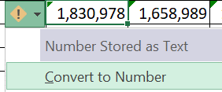

### 4.1.2. Tableau Data Prep

After doing 4.1.1, I import the data into Tableau Prep flow, I filter the countries and regions I want from Variables, and select the Time from 2019 to 2020 monthly basis.

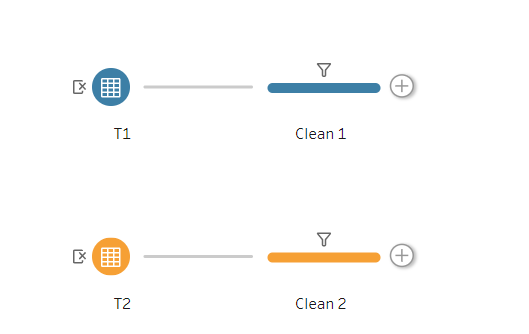
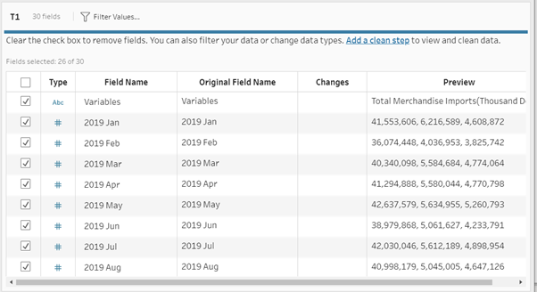

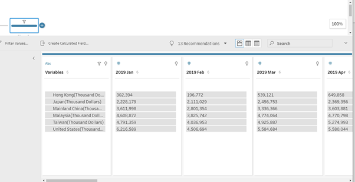

After filtering the data, I run the Output(for import) and Output2(for export) to export csv from T1 and T2.

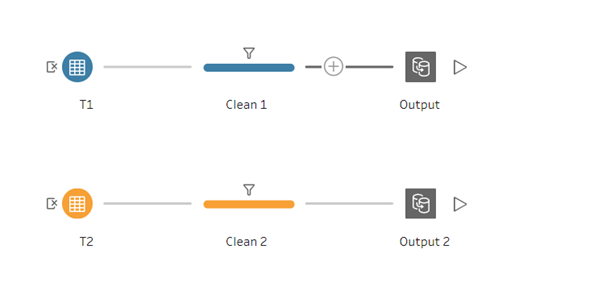

To better do the data transform in R, I change the csv format to xlsx format manually.

### 4.1.3. Data Transform - R

* 1. read excel in to R
```{r,include=TRUE}
import <- readxl::read_xlsx("~/smu/Term3/Visual Analytics-ISSS608/DataViz Makeover 1/Imports.xlsx",
                            sheet = "Imports",range = "A1:Y7",col_names = TRUE)
export <- readxl::read_xlsx("~/smu/Term3/Visual Analytics-ISSS608/DataViz Makeover 1/Exports.xlsx",
                            sheet = "Exports",range = "A1:Y7",col_names = TRUE)
 
```

* 2. eliminate Long words

For better visualization, I delete the unit followed by countries, and change to Import and Export to better distinguish in the plot.

```{r}
for (i in 1:6){
  import[i,1] <- gsub("(Thousand Dollars)","Import",import[i,1])
  export[i,1] <- gsub("(Thousand Dollars)","Export",export[i,1])
}
```

* 3. swtich rows and columns

```{r,warning=FALSE,include=FALSE}
library(tidyr)
library(dplyr)
```

```{r}
import_df <- 
  import %>%
  pivot_longer(-Variables,names_to = 'Time', values_to = 'imports') %>%
  pivot_wider(names_from = Variables, values_from  = imports) 
 
```

```{r}
export_df <- 
  export %>%
  pivot_longer(-Variables,names_to = 'Time', values_to = 'exports') %>%
  pivot_wider(names_from = Variables, values_from  = exports)

```

* 4. write the new data frame into csv

```{r}
write.csv(import_df,file = '~/smu/Term3/Visual Analytics-ISSS608/DataViz Makeover 1/import.csv')
write.csv(export_df,file = '~/smu/Term3/Visual Analytics-ISSS608/DataViz Makeover 1/export.csv')

```

## 4.2 Data Visualization

1. Import clean data into Tableau.

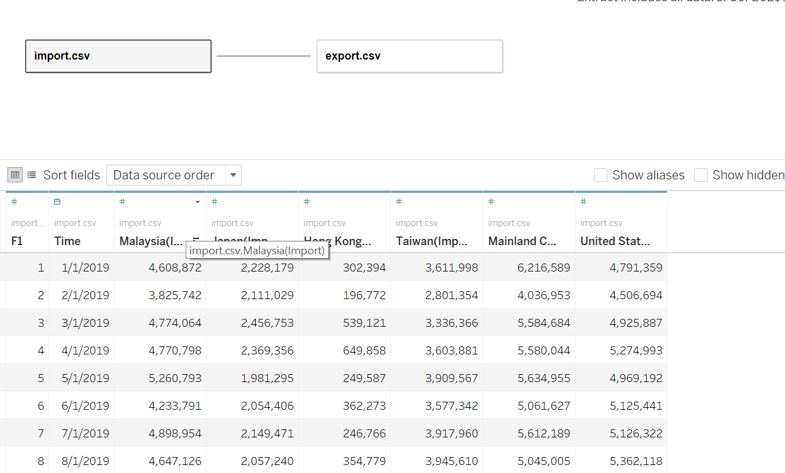

2. Create 6 sheets for 6 countries and regions. (The figure shown is the example of Mainland China).

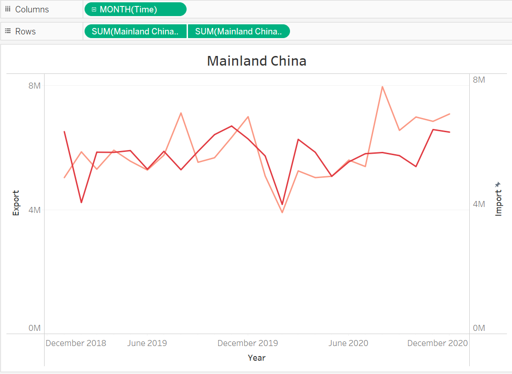

3. Change the axis starts, ends and intervals for each plot.

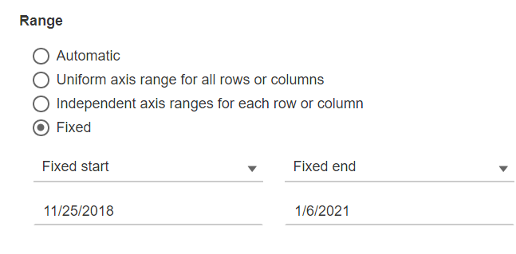


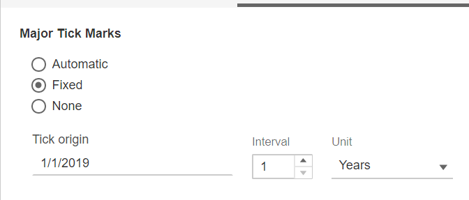

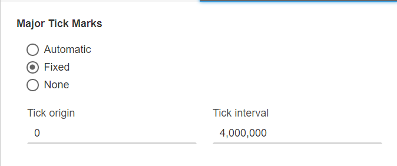

4. Create calculation field

First, I crate the balance of trade, use the formula of Export - Import.

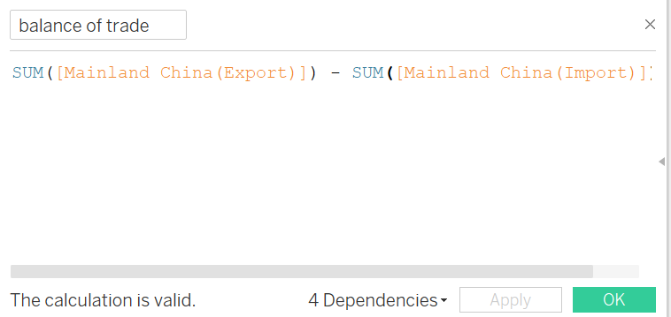

Then, I create Favorable Trade and Unfavorable Trade, so I can separate them and use different colors for better visualization.

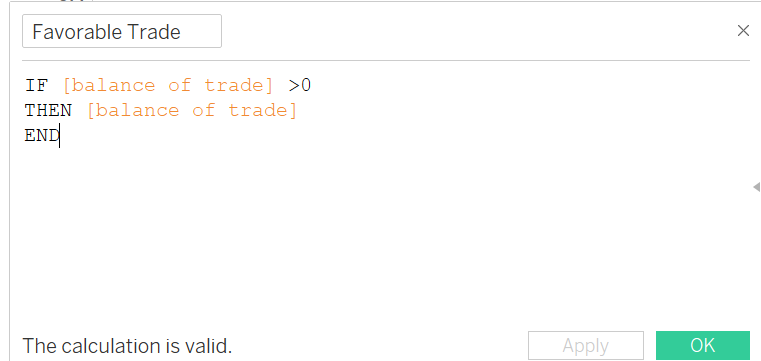

Similar with Favorable Trade calculation field, if balance of trade <= 0, we return balance of trade as Unfavorable Trade.


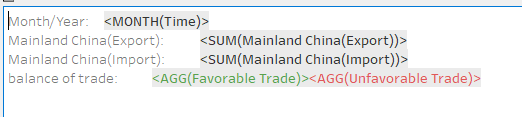

After doing these steps to Mainland China, we do the same steps to other 5 countries and regions.

# 5. Final Visualization
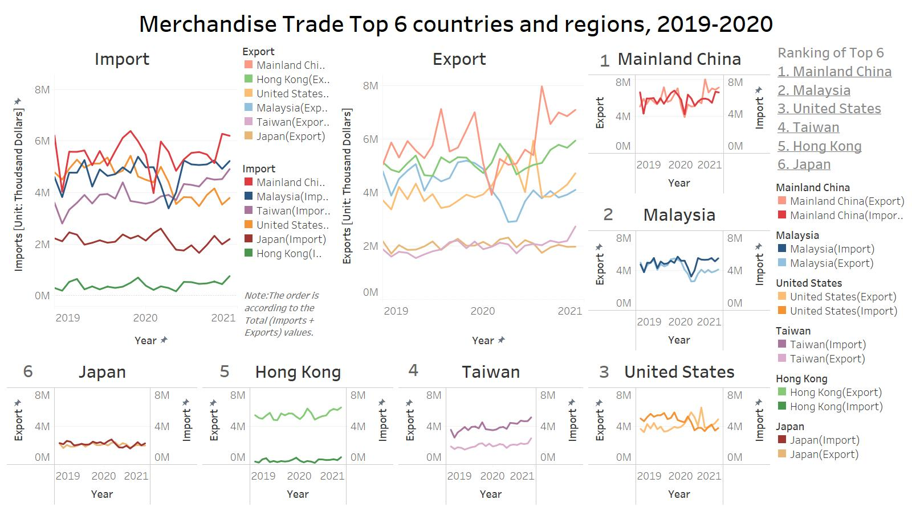

Data Source:*[Merchandise Trade of Singapore](https://www.singstat.gov.sg/find-data/search-by-theme/trade-and-investment/merchandise-trade/latest-data)*

Full visualization available at *[Peirong Lin - Tableau Public](https://public.tableau.com/app/profile/peirong.lin/viz/Visualization1_16223487245810/DataViz1)*

# 6. Main Observatoins

* Hong Kong has the maximum balance of trade among the six countries and regions, while Japan has the minumum.

* To some degree, the export of Mainland China and Malaysia is related to import of theirs, and usually a month former.

* To some degree, the export of United States and Taiwan is a little bit opposite to the import of theirs.

* Both Mainland China and Malaysia have a big drop down in the beginning of 2020, which may be the lock down impact, (The lock down in China is Feb 2020 and Singapore in Apr 2020) while United States raises in Feb 2020 and drop quickly in Sep 2020.


