# Makeover an interactive plot from Merchandise Trade of Singapore


*This is written as the requirements for the [Visual Analytics module](https://wiki.smu.edu.sg/2021t2isss608/Course_information) for [MITB](https://scis.smu.edu.sg/master-it-business).*

This is my second evaluation of Singapore’s Merchandize Trade over 2011 to 2020 and ten countries or regions. I have used the data from [Merchandise Trade of Singapore](https://www.singstat.gov.sg/find-data/search-by-theme/trade-and-investment/merchandise-trade/latest-data).

# 1. The original data visualization


# 2. Critiques and suggestions

## 2.1 Clarity


| S/N   | Critiques     | Comments       |
|:-----:|:------------- |:-------------- |
|   1   | Hard to find the relationship between import and export | List in the Tooltips to show net importers or exporters |
|   2   | Cannot see the trend during the period of 2011 to 2020 | Use interactive animation to see the trend |
|   3   | Cannot show the difference between import and export | Use Tooltips to show the balance of trade |


## 2.2 Aesthetics

| S/N   | Critiques     | Comments       |
|:-----:|:------------- |:-------------- |
|   1   | Too many colors in one graph, which will confuse people | Change to consistent color |
|   2   | Some of circles hide each other | Use transparency to eliminate the overlap |
|   3   | The abbreviation will make people confused sometimes | Add map to be more intuitive |


# 3. Proposed Sketch

## 3.1 Sketch
  


## 3.2 Things to achieve

In this makeover, I will give an interactive visualization by providing the filter of Year. I will illustrate how the trend is for each country or region in these 10 years. Also, I will use map to make each country more intuitive and better for people to know the location and relationship between each trade partner. I will also visualize the difference between exports and imports, which is the balance of trade in this case.

# 4. Data Preparation

## 4.1 convert text to number in excel

First, I open the Outputfile to read the data in excel, and find that all the numbers are in text format, so I change it into number.


After that, I filter the countries and year we need, and paste them into new sheet.

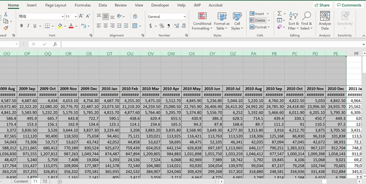
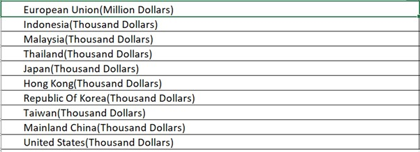

## 4.2 Data Transform using R

* 1. read excel in to R

```{r,include=TRUE}
import <- readxl::read_xlsx("~/smu/Term3/Visual Analytics-ISSS608/DataViz Makeover 2/outputFile.xlsx",
                            sheet = "Import",range = "A1:DQ11",col_names = TRUE)
export <- readxl::read_xlsx("~/smu/Term3/Visual Analytics-ISSS608/DataViz Makeover 2/outputFile.xlsx",
                            sheet = "Export",range = "A1:DQ11",col_names = TRUE)

import
export
```

* 2. eliminate Long words

For better visualization, I delete the unit followed by countries, and change to Import and Export to better distinguish in the plot.

```{r}
import[1,1] <- gsub("(Million Dollars)","Import",import[1,1])
export[1,1] <- gsub("(Million Dollars)","Export",export[1,1])

for (i in 2:10){
  import[i,1] <- gsub("(Thousand Dollars)","Import",import[i,1])
  export[i,1] <- gsub("(Thousand Dollars)","Export",export[i,1])
}
```

* 3. swtich rows and columns

```{r,warning=FALSE,include=FALSE}
library(tidyr)
library(dplyr)
```

```{r}
import_df <- 
  import %>%
  pivot_longer(-Variables,names_to = 'Time', values_to = 'imports') %>%
  pivot_wider(names_from = Variables, values_from  = imports) 
import_df
```

```{r}
export_df <- 
  export %>%
  pivot_longer(-Variables,names_to = 'Time', values_to = 'exports') %>%
  pivot_wider(names_from = Variables, values_from  = exports)
export_df
```

* 4. change values into same unit

Since the unit of each country or region is different, I use dollars as unit and time thousand dollars or million dollars into the values.

```{r}
import_df[2] <- import_df[2]*1000000
export_df[2] <- export_df[2]*1000000
for (i in 3:11){
  import_df[i] <- import_df[i]*1000
  export_df[i] <- export_df[i]*1000
}
import_df
export_df
```

* 5. write the new data frame into csv

```{r}
write.csv(import_df,file = '~/smu/Term3/Visual Analytics-ISSS608/DataViz Makeover 2/import.csv')
write.csv(export_df,file = '~/smu/Term3/Visual Analytics-ISSS608/DataViz Makeover 2/export.csv')

```

## 4.3 Tableau Data Prep

I want to get the filter from country and time, I need extract country from the import and export. Therefore, I import the result csv from R to Tableau Data Prep.


First, I import *'import.csv'* and *'export.csv'* to Tableau Data Prep.

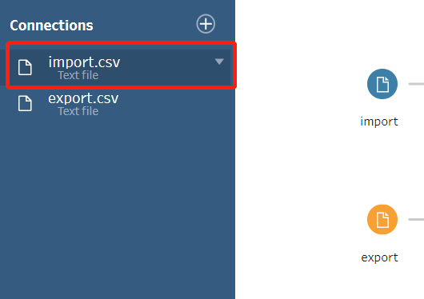

After that, I add a pivot table to these two datasets.

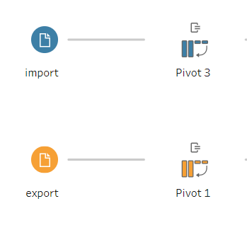

Add all the import columns in it.


Then, I split the pivot names into 2 parts and rename the first one as Country.


After finishing all the steps, I join this two sheets together and save the output as *'Data.csv'*.


# 5. Step of Process

## 5.1 Making bubble plot

* 1. drag the Data from Tableau Data Prep into the area.


* 2. Drag *Export* to Column and *Import* to Row.

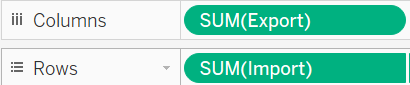


The output looks like this.

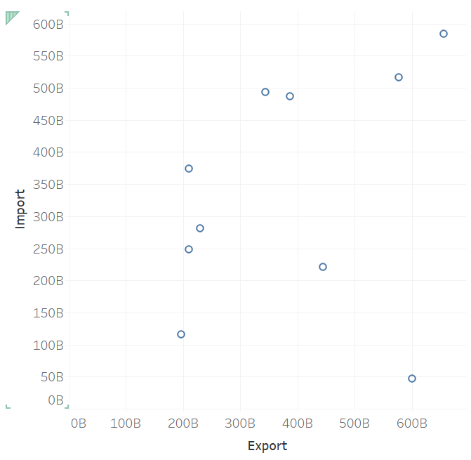

* 3. Calculate fields

First, we calculate balance of trade with *export-import*.


Then, we calculate Total trade with *sum of import and export*.


Then, we calculate Statement.If balance of trade is larger than 0, it is *Net Exporters*. Otherwise, it is *Net Importers*. 


When I get balance of trade, I put it in the color pane. 


The plot looks like this now.


And then we drag Total_trade to size.


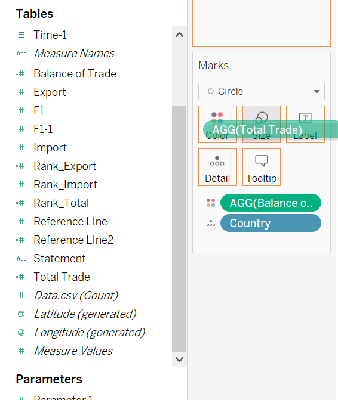

* 4. edit color and add reference lines

Choose the color bar and edit colors

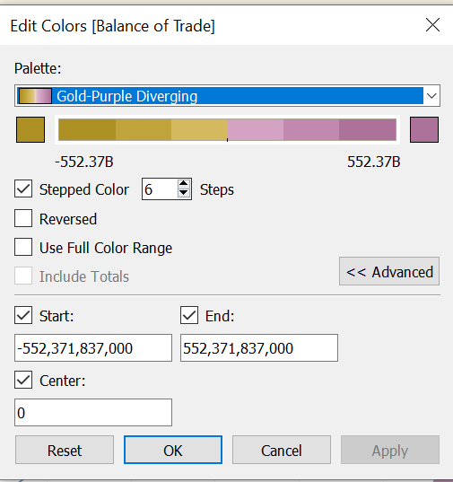

Then, we create a *reference line* calculation field to better separate the area of *Net Exporters* and *Net Importers*.


We drag the reference line to form a synchronize y axis, and change the plot type to line plot.


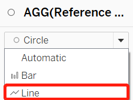

Then, we let the two y axis to be synchronized.


After that, we add the trend line in the Reference line tab.

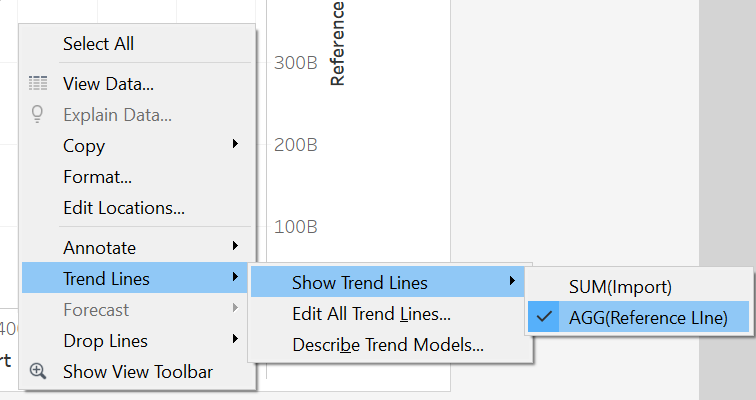

After that, we hide the *Reference Line* axis and only use Import as y axis.


Finally, after editing the title and annotate to the areas, we get the final plot.


## 5.2 Making Balance of Trade chart

* 1. First, we drag *Country* to Columns and *Balance of Trade* to Rows.


* 2. Then, drag Balance of Trade into color pane.


* 3. Edit color and sort the sequence by field.


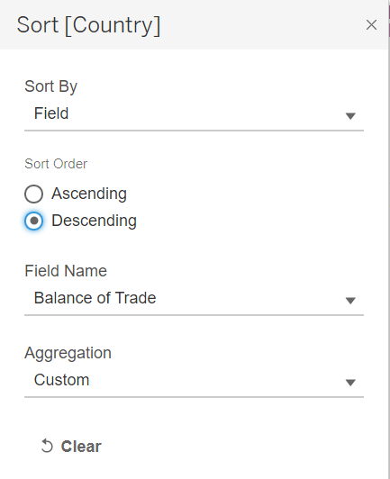

* 4. Finally, we get the final plot.

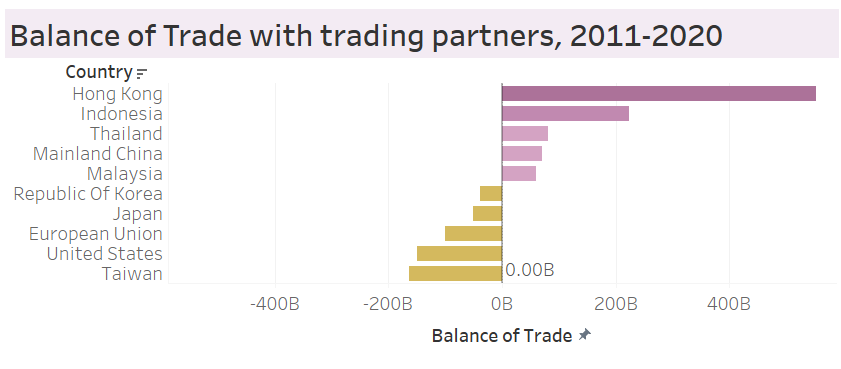

## 5.3 Create Map plot

* 1. Change country geographic role to *Country/Region*.

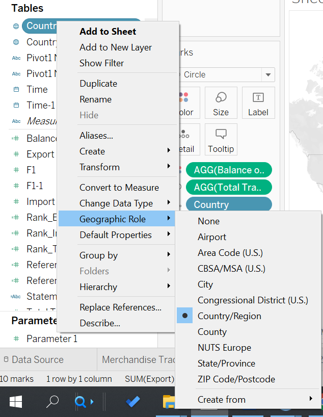

* 2. Drag Export, Import and Country into details. Moreover, drag Total Trade into size.


* 3. Edit color and get the final plot.

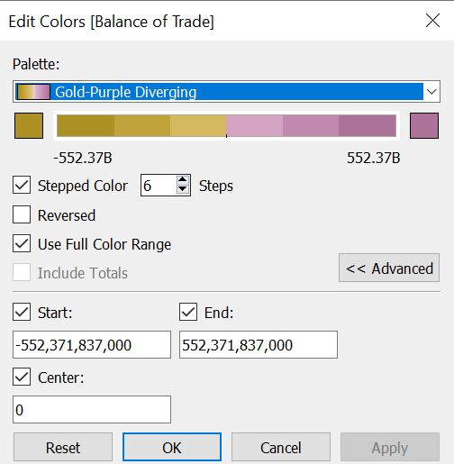


# 6. Final Visualization


Data Source:*[Merchandise Trade of Singapore](https://www.singstat.gov.sg/find-data/search-by-theme/trade-and-investment/merchandise-trade/latest-data)*

Full visualization available at *[Peirong Lin - Tableau Public](https://public.tableau.com/app/profile/peirong.lin/viz/Visualization2_16241789703960/Visulaization2)*

# 7. Main observations

* 1. HongKong is the Top Net Exporters in these 10 years.


* 2. From the map, we can see that most of the trade partners located in Asia.

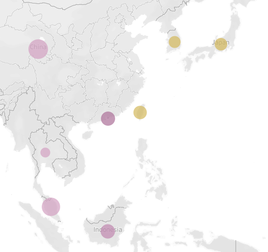

* 3. The Top 1 Total Trade Partner in China recently. Malaysia also has large scale of trading volume.
